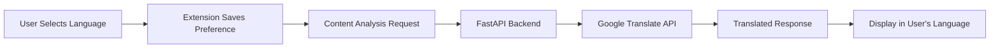

# Cookie Guard - Multilingual Privacy Protection Suite

## 🌍 Multi-Language Support

This Cookie Guard extension now supports **14+ languages** including **Indian local languages** for complete privacy protection analysis.

### 🇮🇳 Supported Indian Languages

- **Hindi (हिंदी)** - `hi`
- **Marathi (मराठी)** - `mr` 
- **Bengali (বাংলা)** - `bn`
- **Tamil (தமிழ்)** - `ta`
- **Telugu (తెలుగు)** - `te`
- **Gujarati (ગુજરાતી)** - `gu`
- **Kannada (ಕನ್ನಡ)** - `kn`
- **Malayalam (മലയാളം)** - `ml`
- **Punjabi (ਪੰਜਾਬੀ)** - `pa`
- **Odia (ଓଡ଼ିଆ)** - `or`
- **Assamese (অসমীয়া)** - `as`
- **Urdu (اردو)** - `ur`

### 🌐 Other Supported Languages

- English, Spanish, French, German, Italian, Portuguese, Russian, Japanese, Korean, Chinese, Arabic, Dutch, and more.

## 🚀 Key Features

### 1. **Intelligent Language Detection**
- Automatically detects user's browser language
- Remembers language preference across sessions
- Easy language switching from popup interface

### 2. **Comprehensive Translation**
- **Privacy Policy Summaries** - AI-generated summaries in your language
- **Risk Assessments** - Security risk levels and explanations
- **Cookie Analysis** - Cookie purposes and recommendations
- **Legal Terms** - Complex legal language simplified
- **User Interface** - Complete UI translation

### 3. **AI-Powered Analysis**
- **BART-based NLP Model** for text classification
- **Multi-language Text Summarization**
- **Risk Score Calculation** with localized explanations
- **Privacy Rights Analysis** in user's native language

## 🛠️ How It Works

### Backend Translation Pipeline



### Translation Architecture

1. **Frontend Language Selection**
   - Language dropdown in popup
   - Persistent storage of preference
   - Real-time UI updates

2. **Backend Processing**
   - Receives language parameter with all requests
   - Processes content with AI models (English)
   - Translates results to target language
   - Returns localized analysis

3. **Content Types Translated**
   - Executive summaries
   - Key privacy points
   - Risk recommendations
   - Legal clause explanations
   - Data collection practices
   - User rights information

## 📱 User Interface

### Language Selector
```html
<select id="languageSelect">
    <option value="en">🇺🇸 English</option>
    <option value="hi">🇮🇳 हिंदी</option>
    <option value="mr">🇮🇳 मराठी</option>
    <option value="bn">🇧🇩 বাংলা</option>
    <!-- ... more languages -->
</select>
```

### Translated Analysis Display
- **Risk Badges**: Color-coded with localized text
- **Summary Cards**: AI summaries in user's language
- **Recommendations**: Actionable advice in native language
- **Legal Explanations**: Complex terms simplified

## 🔧 Technical Implementation

### Backend API Enhancement

```python
@app.post("/analyze_text")
async def analyze_text(data: TextInput):
    # Process with AI models
    summary_data = summarize_text(data.text)
    risk = analyze_risk(summary_data["executive_summary"])
    
    # Translate if needed
    if data.language != "en":
        summary_data = translate_comprehensive_analysis(
            summary_data, data.language
        )
    
    return {
        "summary": summary_data,
        "risk_analysis": risk,
        "language": data.language
    }
```

### Frontend Language Management

```javascript
// Save user preference
async function saveUserLanguagePreference(language) {
    await chrome.storage.sync.set({ userLanguage: language });
}

// Update all translated elements
function updateLanguageDisplay() {
    const elements = document.querySelectorAll('[data-translate]');
    elements.forEach(element => {
        const key = element.getAttribute('data-translate');
        if (translations[currentLanguage][key]) {
            element.textContent = translations[currentLanguage][key];
        }
    });
}
```

## 🎯 Use Cases

### For Indian Users
- **Local Language Support**: Understand privacy policies in Hindi, Tamil, Bengali, etc.
- **Cultural Context**: Explanations adapted for Indian privacy concerns
- **Regional Compliance**: Analysis considering Indian data protection laws

### For Global Users
- **Native Language Analysis**: Privacy analysis in 14+ languages
- **Consistent Experience**: Same quality analysis regardless of language
- **Accessibility**: Lower language barriers for privacy understanding

## 🔒 Privacy & Security

- **No Data Leakage**: Translation happens server-side
- **Encrypted Storage**: Language preferences stored securely
- **Minimal Data**: Only necessary text sent for translation
- **User Control**: Complete control over language preferences

## 📈 Performance Optimization

- **Caching**: Translated results cached for faster access
- **Chunked Translation**: Large texts processed in optimized chunks
- **Error Handling**: Graceful fallback to original text if translation fails
- **Async Processing**: Non-blocking translation operations

## 🚀 Getting Started

1. **Install Extension**: Load the updated extension
2. **Select Language**: Choose your preferred language from popup
3. **Analyze Pages**: Visit any website and click "Full Privacy Analysis"
4. **Review Results**: Get comprehensive analysis in your language

## 🔄 Future Enhancements

- **Voice Output**: Audio playback of analysis in local languages
- **Regional Variants**: Support for regional dialects
- **Offline Mode**: Basic translation without internet
- **Custom Terminology**: User-defined translation preferences

## 📞 Support

For language-specific issues or requests for additional languages, please contact our support team. We continuously work to improve translation quality and add new languages based on user demand.

---

**Note**: Translation accuracy may vary between languages. For critical privacy decisions, we recommend reviewing the original English analysis alongside translated content.